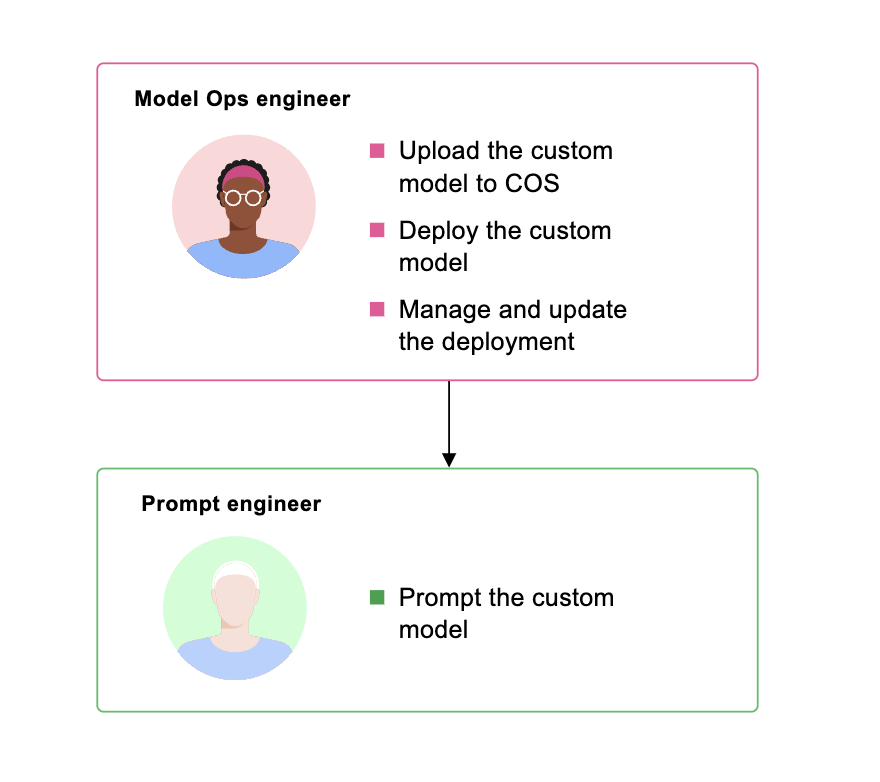
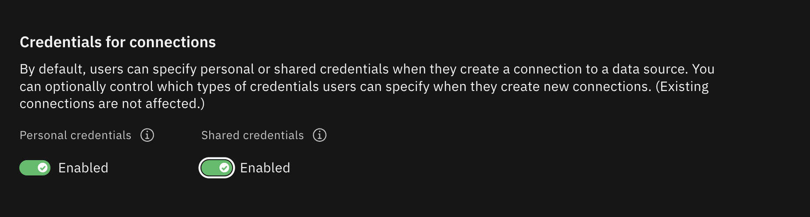
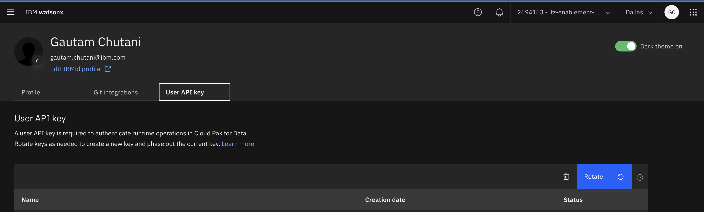
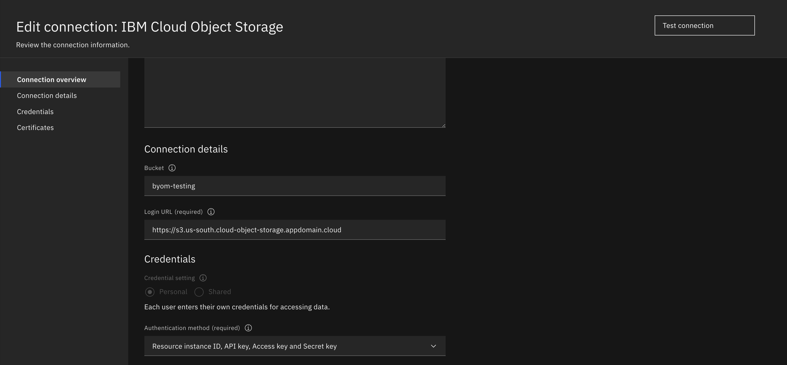
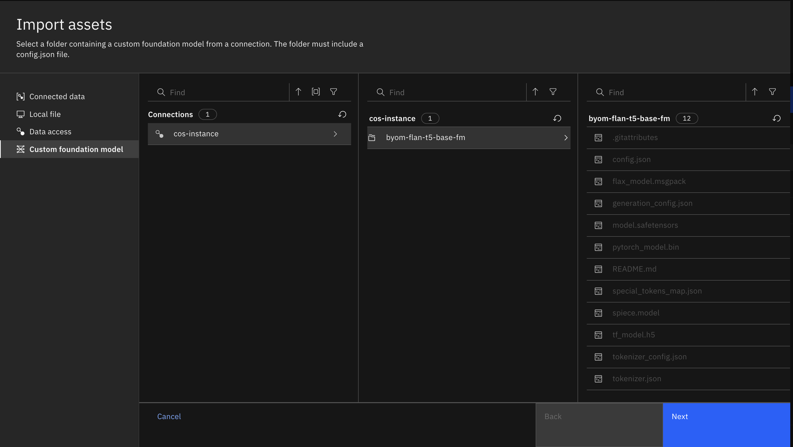
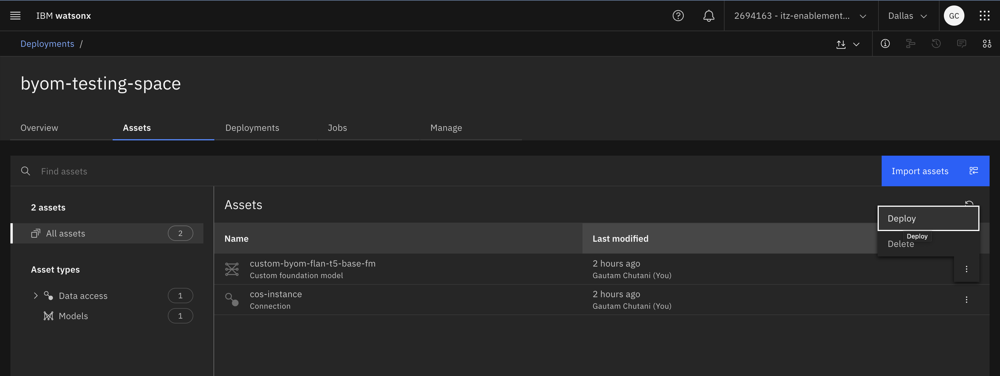
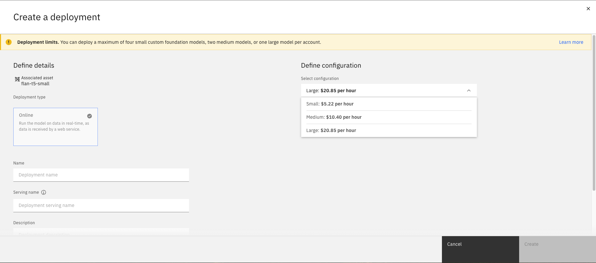
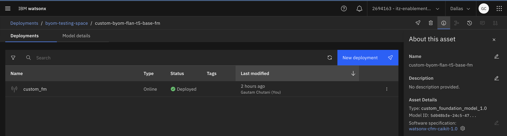
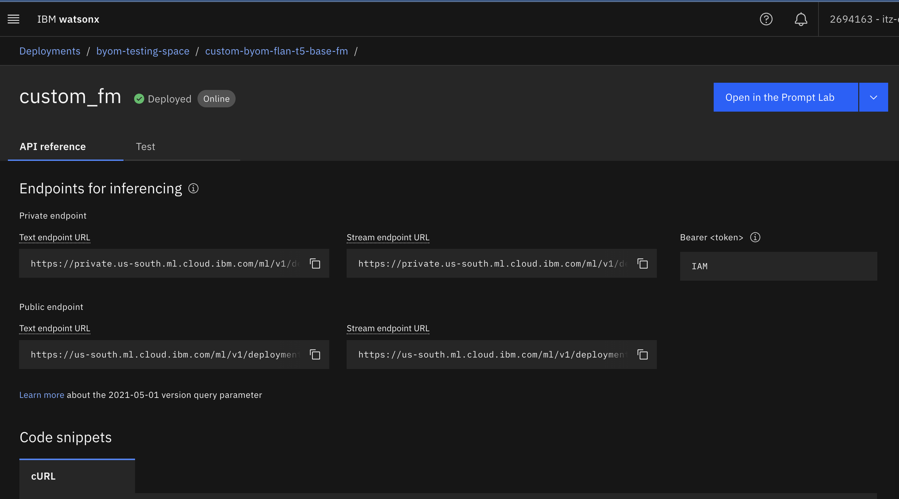
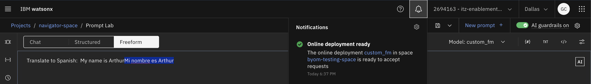

# Deploying Custom Foundation Model using BYOM feature with watsonx.ai SaaS

<br>



<br>

# Review Requirements
1. The feature is currently available only in the `Standard` plan rather than an "Essentials" account for watsonx.ai SaaS.
2. One must have the necessary permissions to create `Personal Credentials` for IBM Cloud Object Storage. The "Shared Credentials" do not work.
2. Model compatibility with the `Text Generation Inference (TGI)` Engine and Server.
3. Built with supported model architecture and quantization method. Refer [here](https://www.ibm.com/docs/en/watsonx/saas?topic=model-planning-deploy-custom-foundation).
4. The model must contain weights in `safetensors` format. 
5. Verify that the `config.json` and `tokenizer.json` files exist for the model.

_Note: These requirements are subject to change as new models and support for different architectures and inference engines are added. Please review the documentation [here](https://www.ibm.com/docs/en/watsonx/saas?topic=assets-deploying-custom-foundation-model) for updates._

<br>

## Downloading Model (from HuggingFace)
To download a custom foundation model by using the Hugging Face command-line interface:

1. Install the huggingface-cli package:

```bash
pip install -U "huggingface_hub[cli]"
```

2. Check that the huggingface-cli is correctly set up:

```bash
huggingface-cli --help
```

3. Log in to Hugging Face command-line interface:

```bash
export HF_TOKEN="HF_Token" 
huggingface-cli login --token ${HF_TOKEN}
```

_Note: To get your huggingface token, visit [here](https://huggingface.co/settings/tokens)_


4. Set up a directory on your local disk to download the model to:

```bash
export MODEL_NAME="<model name>"
export MODEL_DIR="<local directory to download model>"
mkdir ${MODEL_DIR}
```

5. Download the model:

```bash
huggingface-cli download ${MODEL_NAME} --local-dir ${MODEL_DIR} --cache-dir ${MODEL_DIR}
```
<br>

## Setup Cloud Object Storage and Upload Model

__Important Points to Consider:__

- Make sure to use the personal COS credentials! Shared ones don't work. In [dataplatform](https://dataplatform.cloud.ibm.com/settings/account?context=wx), the `Personal` credentials setting must be enabled.
    - Under IBM watsonx, select `Administration > Account and billing > Account` to open the account settings window.
    - Set `Personal` credentials to Enabled. 



- Make sure to create a `User API key` in watsonx dataplatform.



- The bucket name and folder name should not be exactly same.

- While creating COS service credentials, the role must be set to `Manager`.

<br>

Now we can proceed with the uploading of the model to COS.

1. Install the Amazon Web Services command-line interface:

```bash
pip install awscli
```

2. Set the required environment variables:

```bash
export AWS_ACCESS_KEY_ID="<your access key>"
export AWS_SECRET_ACCESS_KEY="<your secret access key>"
export ENDPOINT="<s3 endpoint URL>"
export BUCKET_NAME="<name of the bucket to upload the model>"
MODEL_FOLDER=${MODEL_NAME//\//-} 
export MODEL_FOLDER=${MODEL_FOLDER//./-} 
```

3. Add the model to the IBM Cloud Object Storage bucket:

```bash
echo "Model folder name in cos bucket $MODEL_FOLDER"
aws --endpoint-url ${ENDPOINT} s3 cp ${MODEL_DIR} s3://${BUCKET_NAME}/${MODEL_FOLDER}/ --recursive --follow-symlinks
```
<br>

## Import the Model Asset to a Deployment space

1. To connect to your data source (IBM COS) from the deployment space:

- Go to the Assets tab and click Import assets.
- Select Data assets and then follow the on-screen steps.

_Note: Make sure you have the WML standard version associated with your project. Also, Set the Credential setting to Personal and select Access key and Secret access key for Credentials._



2. In your deployment space, go to Assets and then click Import.

- Select the Custom foundation model option.
- Select the connection to the cloud storage where the model is located.
- Select the folder that contains your model.



<br>

## Creating a deployment for the Model

- In your deployment space, go th the Assets tab.
- Find your model in the asset list, click the Menu icon , and select Deploy.
- Enter a name for your deployment and optionally enter a serving name, description, and tags.
- Select a configuration for your model.  If you want to override some of the base model parameters, click Model deployment parameters and then enter new parameter values. By default, it will use the default model configurations.









When the custom foundation model asset has been created, you are ready to create the online deployment.

<br>

## Prompt your custom foundation model
Now that you have stored and deployed your custom foundation model, you can start using it. You can use the Prompt Lab to prompt the model and generate responses or create a prompt programmatically.



<br>

# References
1. [Official Documentation](https://www.ibm.com/docs/en/watsonx/saas?topic=assets-deploying-custom-foundation-model)
2. [Tutorial - Deploying custom foundation model in watsonx.ai on IBM Cloud](https://developer.ibm.com/tutorials/awb-deploying-custom-foundation-models-watsonx-ai-cloud/)
4. [Managing your account settings for IBM COS](https://dataplatform.cloud.ibm.com/docs/content/wsj/admin/account-settings.html?context=wx&audience=wdp)
5. [Supported model architectures, quantization methods, parallel tensors, deployment configuration sizes, and software specifications](https://www.ibm.com/docs/en/watsonx/saas?topic=model-planning-deploy-custom-foundation)
6. [Troubleshoot Watson Machine Learning](https://www.ibm.com/docs/en/watsonx/saas?topic=troubleshooting-watson-machine-learning)
