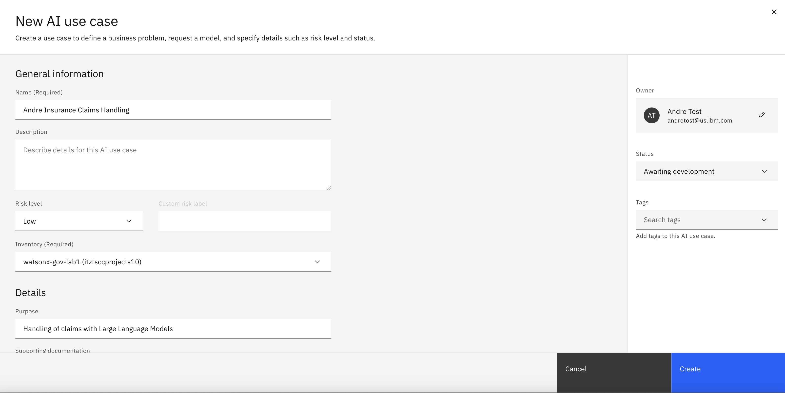

# Lab 2 - Model monitoring

In this lab, you will perform the tasks of a few different personae in the **AI Governance Lifecycle**.  You were a **Prompt Engineer**, in the previous labs, developing a high quality prompts.  Now you will explore roles in the broader **AI Development Team** as you learn to manage and deploy a "model".  Model is in quotes, as in this case, we refer to the combination a prompt (template) and the Large Language Model it uses - through the lens of an AI Use case and monitor its behavior at each stage of its lifecycle.

> Notes: 
> - The data sets that are used for evaluation and payload monitoring are located in the [data](./data/) folder of this repo. 
> - If you encounter some technical issues while working on the labs, please refer to this [troubleshooting document](https://github.ibm.com/client-engineering-watsonxai/watsonx.governance-bootcamp/blob/main/troubleshooting-tips.md). Feel free to add to it as well. 
> - At least some of the instructions below are kept deliberately vague. The intent here is to encourage you to become familiar with the relevant user interfaces, and that includes sometimes having to search for the right place and ways to navigate there.

## Table of Contents

  1. [Create a use case for governing prompts](#create-use-case)
  2. [Govern your first prompt](#govern-prompt-in-use-case)
  3. [Deploy your prompt](#deploy-prompts)

---
### 1. Create a use case for governing prompts<a name="create-use-case"/>
---
Go to the **AI Use Cases** screen and create a new use case. Give it a descriptive name and put it into state **Awaiting Development**.

For the rest of this lab, we will assume you reuse the prompt you created in Lab 1, called **Insurance Summarization Prompt**. If you feel ambitious, you can also create a new prompt and start from scratch. Make sure you test and evaluate the prompt if you do so.
But note that later steps in this lab use predefined data sets to simulate a drift situation. If you use your own prompt, you will also have to generate appropriate data sets, which may be a lengthy process. 

---
### 2. Govern your prompt <a name="govern-prompt-in-use-case"/>
---
Go the **AI Factsheet** tab for your prompt. See that the prompt template is not governed. We want to govern it, so let's add it to the use case we created above. Use the default approach. Make it **Experimental**. 

Note how it shows up as in **Development** in the use case. See how you have two places to get to this info, namely via the prompt and its factsheet, or via use cases.

Next, you will advance the status of your use case to **Development in progress**.  To do this, look for the Status section and click the Edit pencil icon.

In the popop window, select **Development in progress** and click **Apply**.

---
### 3. Deploy Prompts
---

Start by promoting the second prompt to a **Deployment Space**. Go to from the **Projects** view then select the **Promote** action for the three small circles icon to the right-side of your prmopt's name.

Create a new **Deployment Space** to promote your prompt into. Give the **Deployment Space** a unique name with **- Development** attached at the end so we can distinguish from other **Deployment Spaces** we'll be creating.

Select **Development** as the stage, select the default Storage service (itz-cos...) and select the listed machine learning service (itzml-...)

After promoting it, see how it appears in the use case in a new place.

Advance the status of the **Use Case** to **Ready for AI asset validation**.

Now go to the **Deployment Space** and see that the prompt hasn’t actually been deployed. Go to the **Deployment** section, then select the right space, click on **Assets** and then deploy the prompt. 

Then go back to the use case and see the prompt as **Pending Evaluation**.

