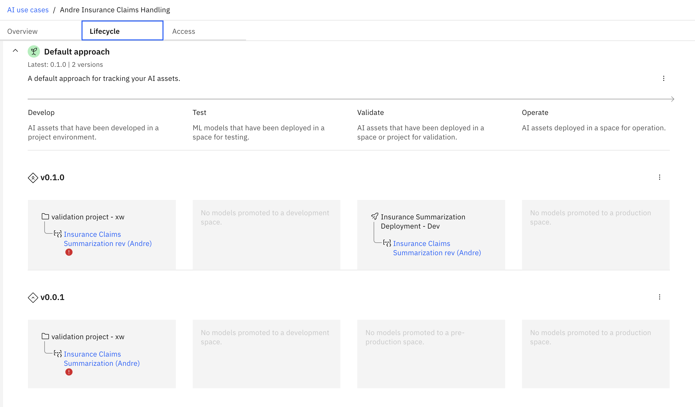

# Lab 3 - Reupdate your Prompt and Keep Anyone Updated

Dalam lab ini, Anda akan melakukan tugas dari beberapa persona berbeda dalam **AI Governance Lifecycle**. Anda adalah seorang **Prompt Engineer**, di lab sebelumnya, yang mengembangkan prompt berkualitas tinggi. Sekarang Anda akan mengeksplorasi peran dalam **AI Development Team* yang lebih luas saat Anda belajar untuk mengelola dan menerapkan "model". Dalam hal ini model merujuk pada kombinasi prompt (template) dan LLM yang digunakannya berdasarkan melalui lensa kasus penggunaan AI dan memantau perilakunya di setiap tahap siklus hidupnya.

> Catatan:

> - Set data yang digunakan untuk evaluasi dan pemantauan muatan terletak di folder data repositori ini.
> - Jika Anda mengalami beberapa masalah teknis saat mengerjakan lab, silakan rujuk pada [troubleshooting document](https://github.ibm.com/client-engineering-watsonxai/watsonx.governance-bootcamp/blob/main/troubleshooting-tips.md).

## Table of Contents

  1. [Create a use case for governing prompts](#create-use-case)
  2. [Govern your first prompt](#govern-prompt-in-use-case)
  3. [Deploy your prompt](#deploy-prompts)

---
### 1. Create a use case for governing prompts<a name="create-use-case"/>
---
Pilih **AI Use Cases** dan buatlah sebuah use case baru. Berikan nama yang deskriptif dan masukkan dalam status **Awaiting Development**.

Untuk  lab ini, kita akan menggunakan kembali prompt yang Anda buat di lab sebelumnya. Jika Anda merasa tertantang, Anda juga bisa membuat prompt baru dan memulainya dari awal. Pastikan Anda menguji dan mengevaluasi prompt jika melakukan hal tersebut.

---
### 2. Govern your prompt <a name="govern-prompt-in-use-case"/>
---
Pilih ke **AI Factsheet** tab pada prompt Anda. Dapat dilihat bahwa prompt template belum ter-govern. Karena kita perlu menambahkan governance ke prompt template kita, tambahkan prompt template tersebut ke use case yang sudah dibuat. Pilih default approach dan **Experimental**.

Perhatikan bagaimana **Develop** muncul di dalam use case. Anda memiliki dua cara untuk mengakses informasi ini, yaitu melalui prompt dan factsheet-nya, atau melalui use cases.

Selanjutnya, Anda akan mengubah status use case Anda ke **Development in progress**. Untuk melakukan ini, cari bagian Status dan klik icon Edit (pencil).

Di pop-uo window, pilih **Development in progress** dan klik **Apply**.

---
### 3. Deploy Prompts
---

Mulai dengan promote prompt anda ke sebuah **Deployment Space**. Dari **Projects**, pilih _action_ **Promote** di tiga lingkaran kecil di bagian kanan nama prompt. 

Buat **Deployment Space** baru untuk mem-_promote_ prompt Anda. Berikan **Deployment Space** tersebut nama unik dengan _- Development_ di akhir agar kita dapat membedakannya dari **Deployment Spaces** lain yang akan kita buat.

Pilih **Development** sebagai _stage_, lalu pilih layanan _Storage_ default (itz-cos...) dan pilih layanan _machine learning_ yang terdaftar (itzml-...).

Setelah mem-_promote_ prompt anda, lihat bagaimana prompt tersebut muncul di use case di tempat baru.

Ubah status **Use Case** menjadi **Ready for AI asset validation**.

Sekarang pergi ke **Deployment Space** dan lihat bahwa prompt tersebut sebenarnya belum di-_deploy_. Pergi ke bagian **Deployment**, kemudian pilih space yang benar, klik **Assets** dan kemudian deploy prompt tersebut.

Kemudian kembali ke use case dan lihat prompt sebagai **Pending Evaluation**

